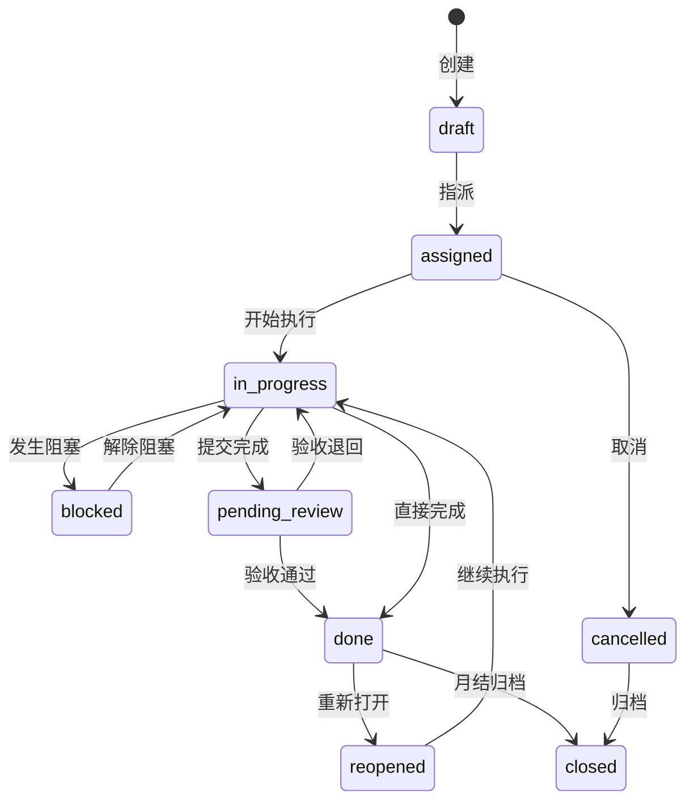
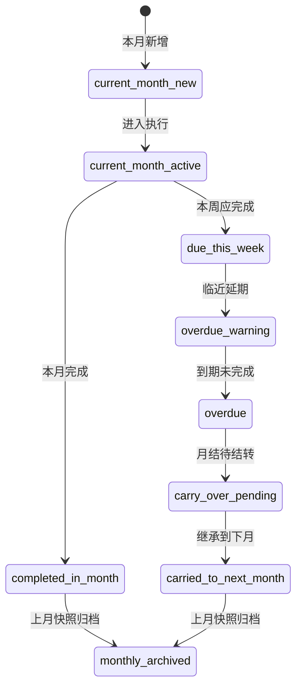
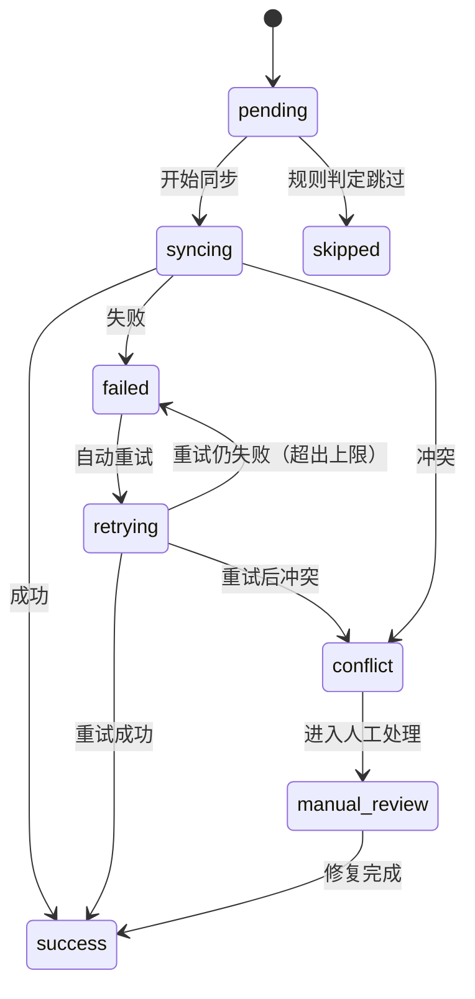
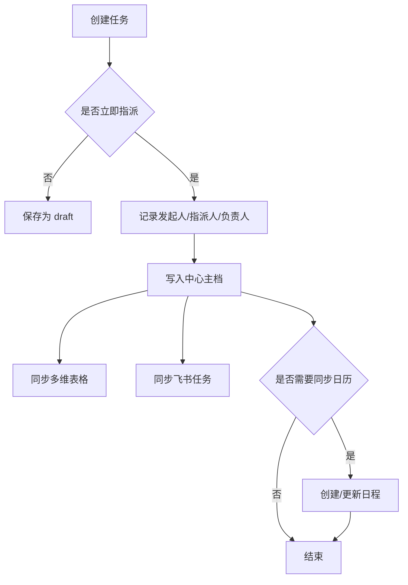
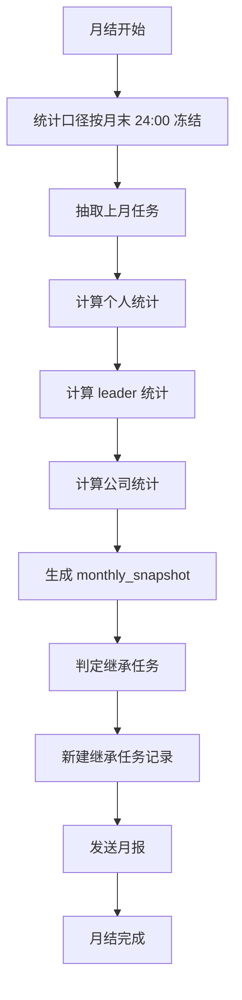
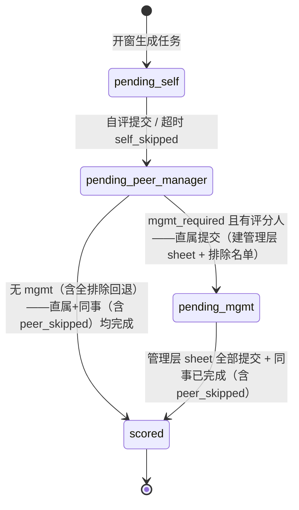
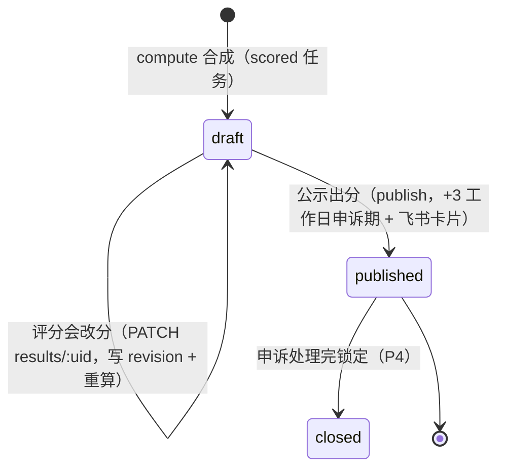
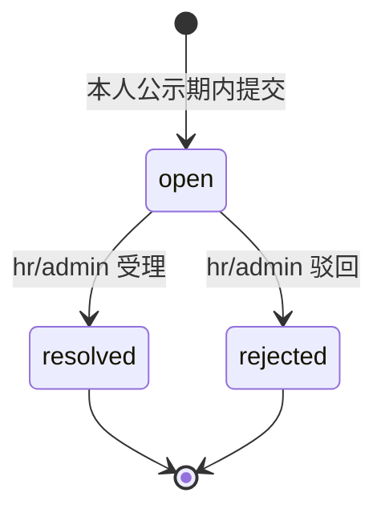

# 状态机与流程

> 状态枚举值以 enum-dictionary.md 为准。

## 1. 任务生命周期状态机

## 2. 生命周期状态说明

| 状态 | 中文 | 说明 |
|---|---|---|
| draft | 草稿 | 已创建但未正式派发 |
| assigned | 已指派 | 已有负责人，待开始 |
| in_progress | 进行中 | 正在处理 |
| blocked | 阻塞 | 有阻塞因素 |
| pending_review | 待验收 | 已提交，待确认 |
| done | 已完成 | 业务完成 |
| reopened | 重新打开 | 已完成后重新处理 |
| cancelled | 已取消 | 终止 |
| closed | 已归档 | 历史归档状态 |

## 3. 状态流转规则

### 3.1 创建后
- 默认进入 `draft`
- 若创建时已明确负责人并立即生效，可直接进入 `assigned`

### 3.2 开始执行
- `assigned -> in_progress`
- 触发条件：负责人确认开始或第一次更新进展

### 3.3 阻塞
- `in_progress -> blocked`
- 要求：必须填写阻塞原因

### 3.4 提交完成
- `in_progress -> pending_review`
- 适用于需要 leader / 发起人验收的任务

### 3.5 完成
- `pending_review -> done`
- 或 `in_progress -> done`

### 3.6 重新打开
- `done -> reopened`
- 要求：必须记录重新打开原因

### 3.7 归档
- `done -> closed`
- `cancelled -> closed`
- 由月结或归档任务触发

## 4. 月度周期状态机

## 5. 同步状态机

> 枚举值以 enum-dictionary.md `sync_status` 为准。

## 6. 指派流程

## 7. 月结流程

## 8. 季度考核串行门控（quarter_task.stage —— 2026-07-09，P2）

Harvey 定：**串行打分**——自评 → 同事+直属（并行）→ 管理层，逐环解锁；自评超时 3 天自动放行（标 `self_skipped`，防一人卡全链）。纯推导逻辑见 `apps/api/src/modules/quarter/quarter-logic.ts`（`computeQuarterStage`），每次 sheet 提交后重算。

门控规则（`computeQuarterStage` / `computeSheetLock`）：

- **自评（self）**：仅 `pending_self` 可填；提交或超时 → `pending_peer_manager`。自评仅参照、不计分。
- **同事(peer)+直属(manager)**：`pending_self` 时锁定（"等待本人完成自评"），其后并行解锁。
- **管理层(management)**：仅 `pending_mgmt` 可填（"等待直属完成打分"）；直属提交且 `mgmt_required` 时，服务端计算「一级部门 leader/直属/本人」排除名单（缺部门数据回退管理链规则），生成 management draft sheet 并写 `mgmt_trace` 留痕。
- **终态**：无 mgmt 员工在直属+同事都完成后 → `scored`；`mgmt_required` 任务在直属+同事 + **管理层 sheet 全部提交**后 → `scored`（P3 收口，`computeQuarterStage` 增 `mgmtSheetsExist`/`allMgmtSubmitted` 判据，每张 management sheet 提交后重算）。
- **缺失 sheet 不阻塞**：无直属（no-manager）或未指定同事（no-peer）时该环节视为"无需等待"。
- **硬化2 · 管理层全排除回退**：`mgmt_required` 任务在直属提交时，若排除规则算完管理层评分人为空（小部门/都在排除名单），则**不建 management sheet、不进 `pending_mgmt`**，`computeQuarterStage` 以 `mgmtRatersEmpty=true` 退化为「无 mgmt」路径（直属+同事完成即 `scored`），`mgmt_trace` 留痕 `rule='all_excluded_fallback'`、`raterIds=[]`。合成（`computeResult`）走 mgmt 缺席分支。
- **硬化3 · 同事超时放行**：`computeQuarterStage` 新增 `peerSkipped` 判据，`peer_skipped=true` 视同「同事已完成」参与门控。

超时放行由 worker 每日执行（幂等，dry-run 支持）：
- `advance-self-timeout`（09:05）：`pending_self` 且过 `stage_deadlines.self` → `self_skipped=true` + `stage=pending_peer_manager`，自评 sheet 保持 draft 不删。
- `advance-peer-timeout`（09:10，硬化3）：`pending_peer_manager`、`peer_skipped=false` 且过 `stage_deadlines.peer_manager`、同事 sheet 未提交 → `peer_skipped=true`；重算 stage（非 mgmt 且直属已完成 → `scored`，否则维持 `pending_peer_manager` 等直属）。未指定同事 / 同事已提交 → 跳过不放行。

## 9. 季度合成结果生命周期（quarter_result.status —— 2026-07-09，P3）

`quarter_task.stage=scored` 后，管理角色触发合成（`POST /quarter/tasks/:uid/result/compute` 或批量），从已提交 sheet 取数 → `mergeSoft`/`quarterlyTotal`/`quarterlyGrade` 写一条 `quarter_result`（draft，一任务一条幂等 upsert）。逻辑见 `apps/api/src/modules/quarter/quarter-result.service.ts`。

- **draft**：评分会可反复改分（`goal_score`/`soft_merged` 重算 total/grade；`total`/`grade` 仅记录），每次写 `quarter_result_revision`（reason 必填）。批量合成会覆盖 draft（改分前执行），故顺序为「合成 → 改分 → 公示」。
- **published**：`publish` 将 cycle 内全部 draft 结果置 published、`appeal_deadline_at = published_at + 3 个工作日`（domain-core `addWorkingDays`，跳周六日），并给每个被评人发飞书卡片（失败 warn 不阻塞）。published 后**禁改分**（`PATCH results` 返回 403）。
- **申诉（quarter_appeal.status）**：`open`（本人 published 且未过 `appeal_deadline_at` 提交，一 result 至多一条 open）→ hr/admin 处理为 `resolved` / `rejected`（resolution 必填）。提交时给 hr 角色绑定用户发卡片。

## 10. 半年合成 + 定级定岗联动（2026-07-09，P4a）

半年合成不是状态机，是幂等派生：`POST /quarter/half-year/compute {half}`（admin/boss/hr）对该半年（H1=Q1+Q2，H2=Q3+Q4）有 published `quarter_result` 的人算 `halfYearTotal`（双季→`40/60`，仅一季→`single_100`）+ `quarterlyGrade`，upsert 一条 `half_year_result`（唯一 `(half, ratee_user_id)`，可重复执行覆盖）。

定级定岗联动为只读派生，不新建职级记录：

- **快照回填**：`POST /quarter/cycles/:uid/backfill-grade-snapshot`（admin/boss/hr）把 cycle 内每个 published `quarter_result` 回填到该人**最新** `grade_history.score_snapshot`（`{quarter,total,grade,soft_merged,goal_score}`）；无 `grade_history` 记录则跳过 + warn。
- **资格判定**：`GET /quarter/promotion-eligibility?ratee_user_id`（本人/直属/管理角色）读该人 published `quarter_result` 的 (quarter, grade) 序列，`promotionEligible` 纯函数判定——**当季总评 S**，或**连续两季 A 及以上**（S 亦算 A 及以上，两季须相邻）。

> `mergeSoft` 四分支口径（硬化1）：缺席方（管理层/同事）权重并入直属，见 enum-dictionary.md「soft_weights_group」与 spec §4。
