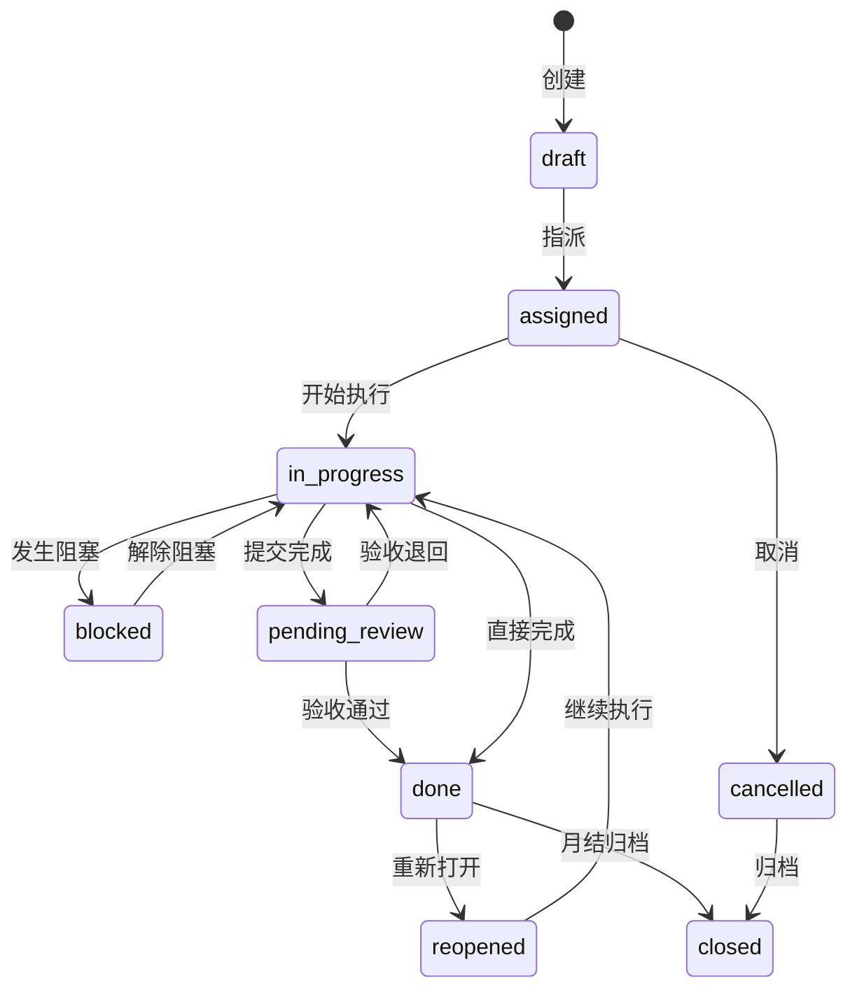
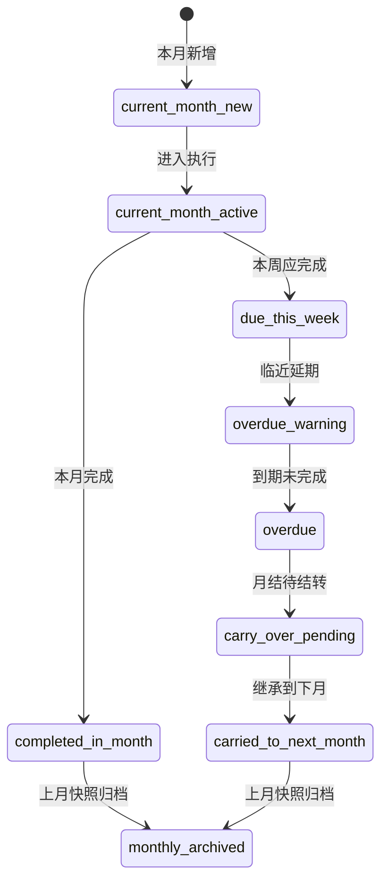
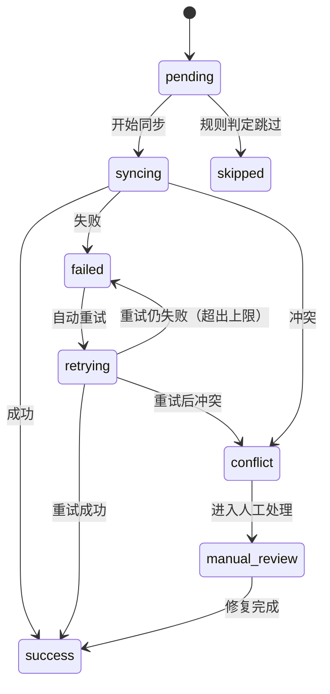
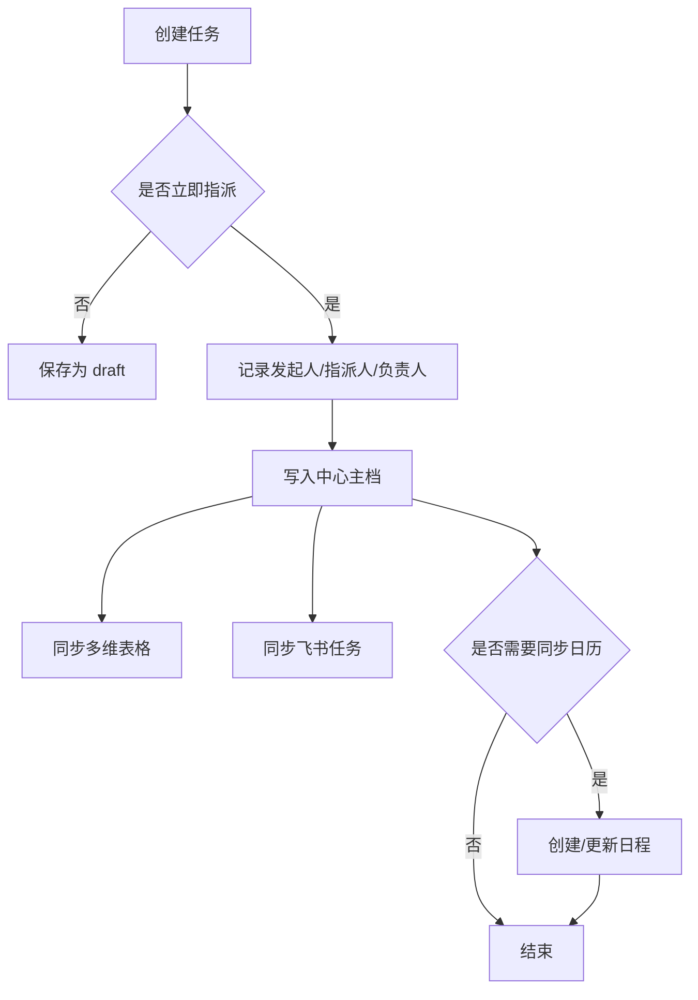
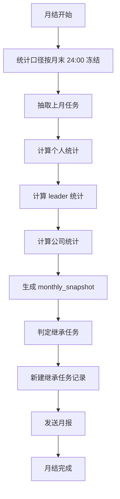

# 状态机与流程

> 状态枚举值以 enum-dictionary.md 为准。

## 1. 任务生命周期状态机

## 2. 生命周期状态说明

| 状态 | 中文 | 说明 |
|---|---|---|
| draft | 草稿 | 已创建但未正式派发 |
| assigned | 已指派 | 已有负责人，待开始 |
| in_progress | 进行中 | 正在处理 |
| blocked | 阻塞 | 有阻塞因素 |
| pending_review | 待验收 | 已提交，待确认 |
| done | 已完成 | 业务完成 |
| reopened | 重新打开 | 已完成后重新处理 |
| cancelled | 已取消 | 终止 |
| closed | 已归档 | 历史归档状态 |

## 3. 状态流转规则

### 3.1 创建后
- 默认进入 `draft`
- 若创建时已明确负责人并立即生效，可直接进入 `assigned`

### 3.2 开始执行
- `assigned -> in_progress`
- 触发条件：负责人确认开始或第一次更新进展

### 3.3 阻塞
- `in_progress -> blocked`
- 要求：必须填写阻塞原因

### 3.4 提交完成
- `in_progress -> pending_review`
- 适用于需要 leader / 发起人验收的任务

### 3.5 完成
- `pending_review -> done`
- 或 `in_progress -> done`

### 3.6 重新打开
- `done -> reopened`
- 要求：必须记录重新打开原因

### 3.7 归档
- `done -> closed`
- `cancelled -> closed`
- 由月结或归档任务触发

## 4. 月度周期状态机

## 5. 同步状态机

> 枚举值以 enum-dictionary.md `sync_status` 为准。

## 6. 指派流程

## 7. 月结流程

