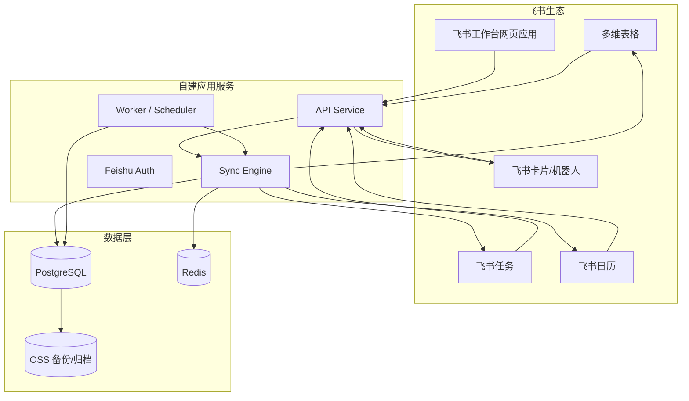

# 系统架构设计

## 1. 目标

本文档定义“飞书领导月度督办系统”的整体技术架构，作为后端、前端、同步引擎、运维和集成工作的统一基线。

## 2. 架构原则

1. PostgreSQL 是中心主档。
2. 多维表格、飞书任务、飞书日历都是外部投影与交互入口。
3. 所有跨系统写操作必须经过 sync-engine。
4. 所有外部事件都必须先入事件日志，再进入业务处理。
5. 所有定时任务必须支持重试、补偿、dry-run。
6. 所有业务口径必须基于中心主档和月结快照，不直接拼接外部系统实时结果。

## 3. 总体架构图

## 4. 模块说明

### 4.1 API Service
负责：
- 飞书登录态校验
- 页面数据查询
- 手工操作入口
- 飞书回调接收
- 任务创建、更新、指派、验收接口

### 4.2 Worker / Scheduler
负责：
- 周提醒
- 临期提醒
- 月结
- 对账与补偿
- 定时同步修复

### 4.3 Sync Engine
负责：
- 外部系统字段映射
- 同步方向控制
- 字段主权判断
- 冲突识别
- 幂等处理
- 写回防循环

### 4.4 PostgreSQL
负责：
- 任务主表
- 月结快照
- 事件日志
- 同步日志
- 外部映射关系
- 用户角色与权限缓存

### 4.5 Redis
负责：
- 幂等键
- 分布式锁
- 短期缓存
- 队列辅助状态

## 5. 核心数据流

### 5.1 创建任务
1. 用户从网页应用或多维表格创建任务。
2. API 写入中心主档。
3. Sync Engine 生成外部同步任务。
4. Worker 异步同步到多维表格、飞书任务、飞书日历。
5. 写入 sync_log。

### 5.2 外部事件回写
1. 外部系统产生变更事件。
2. API 接收回调并写入 inbound_event。
3. 通过 source_event_id 做幂等去重。
4. Sync Engine 根据字段主权判断是否采纳。
5. 更新中心主档并分发到其他外部系统。

### 5.3 月结
1. 统计口径按月末 24:00 冻结，作业于次月 1 日 08:00 执行。
2. Worker 统计本月新增、应完成、完成、延期、继承。
3. 生成 monthly_snapshot（含 snapshot_run_id、snapshot_version）。
4. 对未完成任务新建继承记录（不修改原记录）。
5. 向老板、leader、员工发送月报。

## 6. 同步边界

### 6.1 中心主档字段
- 组织归属字段
- 指派关系字段
- 月份归属字段
- 派生统计字段
- 外部映射字段

### 6.2 双向字段
- 状态
- 进度百分比
- 最新进展
- 实际完成日期
- 截止日期

### 6.3 单向字段
- 剩余天数
- 是否延期
- 月快照结果
- 继承关系

## 7. 非功能要求

- 回调接口响应时间目标：3 秒内返回受理结果
- 幂等键两层保留：热缓存 7 天（Redis）+ 持久审计日志 90 天（PostgreSQL）
- 所有关键操作保留审计日志
- 月结任务必须可重复执行
- 所有失败同步都必须进入补偿队列

## 8. 技术建议

- API：NestJS 或 Next.js + Route Handlers
- DB：PostgreSQL
- Cache/Lock：Redis
- Deploy：Docker Compose 起步
- Reverse Proxy：Nginx 或 Caddy
- Logs：结构化 JSON 日志
- Monitoring：应用健康检查 + 错误告警

## 9. 待补充

- 真实飞书权限列表
- 生产环境回调签名校验实现
- 任务中心字段映射的最终版本
